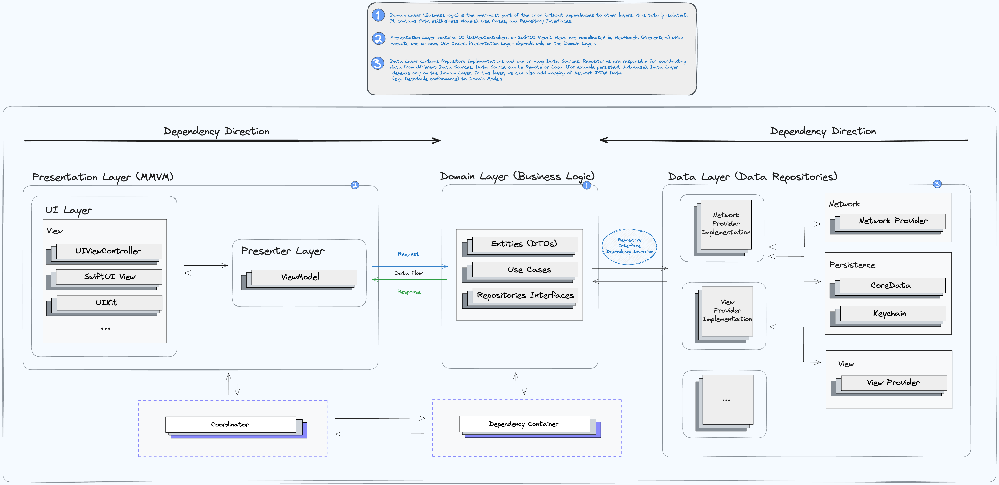
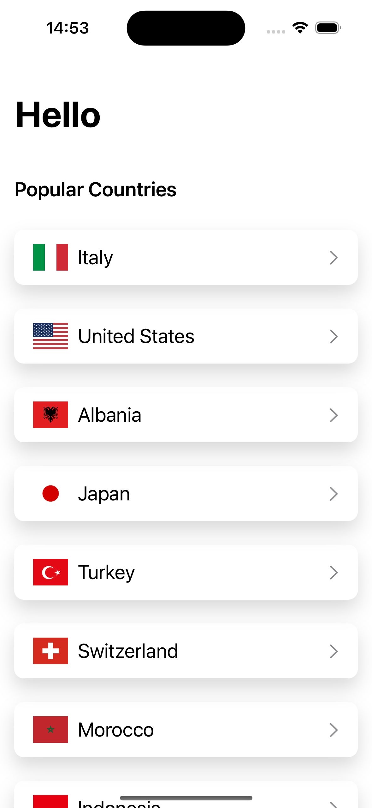
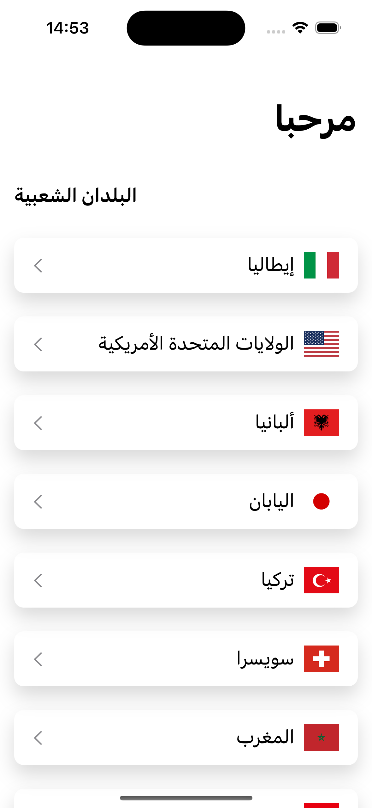
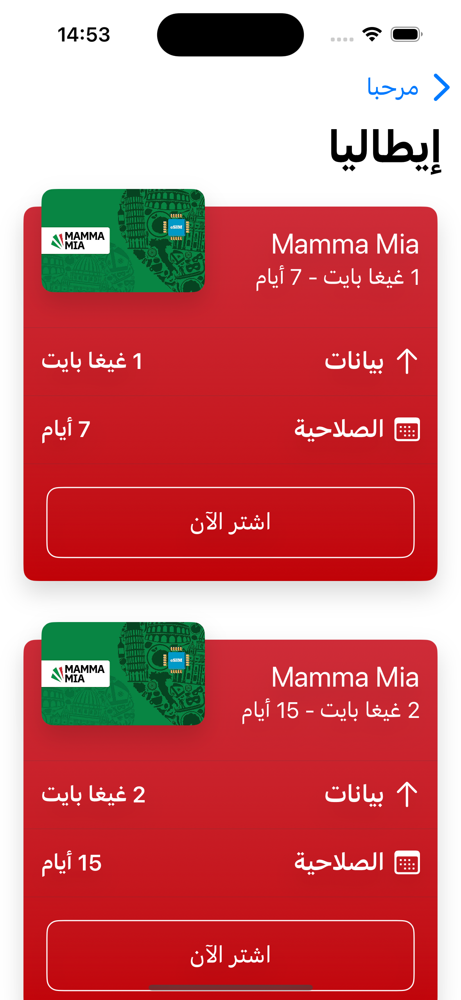

# Airalo Take Home Test

## Overview
This project is built using a clean MVVM architecture, incorporating use cases and flow coordinators to ensure a scalable and maintainable codebase. 

## Features

- **Clean MVVM Architecture**: The app follows a clean MVVM (Model-View-ViewModel) architecture, separating concerns to improve testability and maintainability.
- **Use Cases**: Business logic is encapsulated in use cases, providing a clear and organized way to handle different actions within the app.
- **Flow Coordinators**: Navigation and flow management are handled by coordinators, which decouple view controllers and make the navigation logic more reusable and easier to manage.

## UI/UX

- **Pixel Perfect Design**: The user interface is meticulously designed to ensure pixel-perfect alignment.
- **Accessibility**: The app is built with accessibility in mind, ensuring that all users, including those with disabilities, can use the app effectively.
- **Right-to-Left Support**: The UI supports right-to-left languages, ensuring a seamless experience for users who read from right to left.

## Screenshots
Include some screenshots of your app here to showcase the pixel-perfect design and RTL support.

